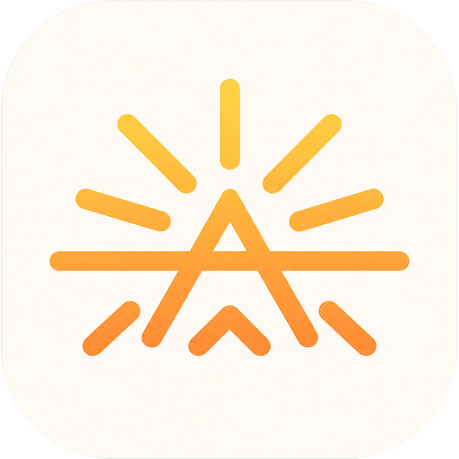
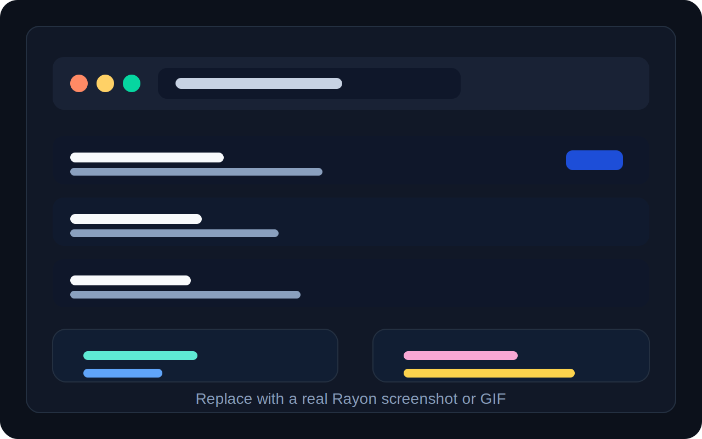

# Rayon

<p align="center">
  
</p>

<p align="center">
  <strong>The open source launcher for macOS that stays fast, lightweight, and under your control.</strong>
</p>

<p align="center">
  Rayon is a keyboard-first app launcher built for people who want the speed of modern launcher tools, the flexibility of local configuration, and a foundation that can grow through extensions and plugins.
</p>

<p align="center">
  <a href="https://github.com/alexandrelam/rayon/releases">Download for macOS</a>
  ·
  <a href="#build-from-source">Build from source</a>
  ·
  <a href="#configuration">Configure Rayon</a>
</p>

> If you know Raycast, Rayon is aiming at a similar level of everyday usefulness with an open source, composable approach.

## Demo



_Replace this image with a screenshot or GIF of the launcher in action._

## Why Rayon

- **Fast by default.** Rayon is built with Rust, Tauri, and React to keep the launcher responsive and lightweight.
- **Keyboard first.** Open the launcher, search instantly, and trigger apps, bookmarks, or commands without leaving the keyboard.
- **Configurable locally.** Add your own commands and bookmarks through TOML files in your home config directory.
- **Composable foundation.** Built-in features and future extensions are designed around the same command model.
- **Open source and hackable.** You can inspect the code, build it yourself, and shape how the launcher evolves.

## Getting Started

### Install From GitHub Releases

The easiest way to install Rayon on macOS is through the GitHub Releases page.

1. Open the [latest releases](https://github.com/alexandrelam/rayon/releases).
2. Download the `.dmg` asset for the version you want.
3. Open the disk image and drag Rayon into your `Applications` folder.
4. Launch Rayon from `Applications`.

### Launch Shortcut On macOS

Rayon tries to register `Command+Space` as the launcher shortcut. macOS Spotlight uses the same shortcut by default, so you may need to change Spotlight first.

1. Open `System Settings > Keyboard > Keyboard Shortcuts`.
2. Select `Spotlight`.
3. Disable `Show Spotlight search` or move it to a different shortcut.
4. Relaunch Rayon.

If `Command+Space` is unavailable, Rayon also tries `Command+Shift+Space` as a fallback.

## Build From Source

If you want to build Rayon yourself, the repository is set up for a straightforward local workflow.

### Prerequisites

- Rust toolchain
- Node.js
- `pnpm`
- Tauri prerequisites for macOS

### Development

```bash
pnpm install
pnpm tauri dev
```

### Build And Check

```bash
pnpm build
pnpm test
cargo test --workspace
```

## Configuration

Rayon can load user-defined commands and bookmarks from your config directory.

Config files live in:

- `$XDG_CONFIG_HOME/rayon` when `XDG_CONFIG_HOME` is set
- `~/.config/rayon` otherwise

Example bookmark manifest:

```toml
plugin_id = "user.bookmarks"

[[bookmarks]]
id = "user.github"
title = "GitHub"
url = "https://github.com"
subtitle = "Code hosting"
keywords = ["git", "repos", "source"]
```

Example custom command manifest:

```toml
plugin_id = "user.commands"

[[commands]]
id = "user.echo"
title = "Echo"
program = "/bin/echo"
base_args = ["hello from Rayon"]
```

For the full manifest format and troubleshooting details:

- [Custom Commands](docs/custom-commands.md)
- [Bookmarks](docs/bookmarks.md)

## Architecture Direction

Rayon already supports built-in actions, app discovery, bookmarks, and config-driven commands. The project is also being shaped toward a more composable extension model, where built-in features and contributor plugins can register through the same backend contract over time.

That direction is still in progress today, so the plugin story should be read as the product direction rather than a fully general runtime that is already complete.

## Contributing

Contributions are welcome.

- Open an issue if you find a bug, want to propose a workflow improvement, or want to discuss a feature direction.
- Open a pull request if you want to improve the launcher, configuration system, or platform integration.
- Read [docs/project-structure.md](docs/project-structure.md) if you want a quick map of the workspace before making deeper changes.

## License

Rayon is released under the GNU Affero General Public License v3.0 (AGPL-3.0).
